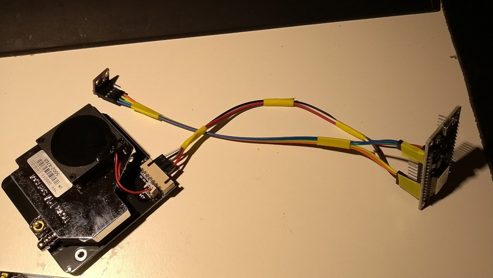
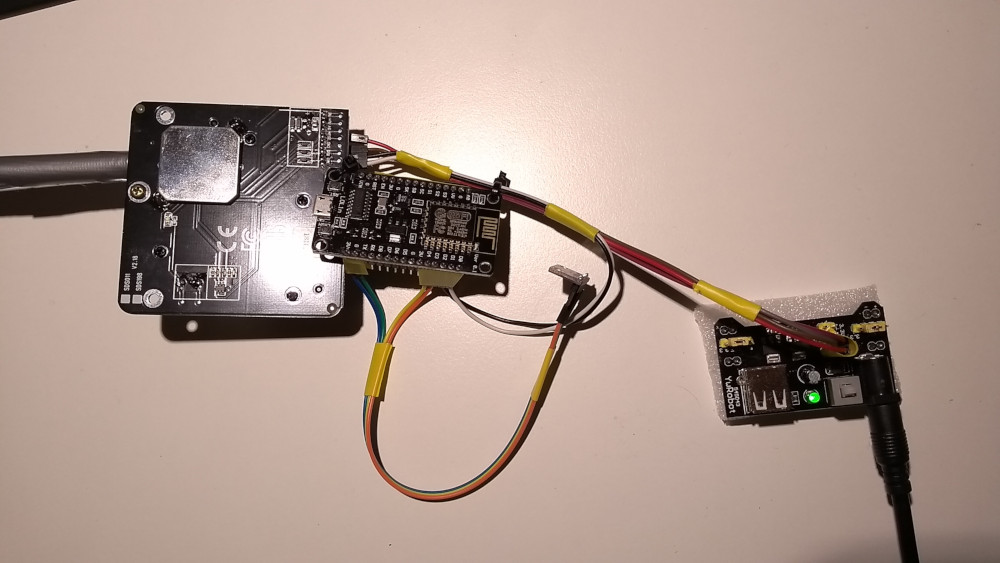

A "Feinstaubsensor" measures the fine particulate matter in the air (in german "Feinstaub"), usually the particles in the categories PM2.5 and PM10. PM2.5 includes every particle that has a smaller diameter than 2.5µm and it is a subset of PM10, which measures every particle with a diameter of 10µm or less.  
According to the WHO a high rate of these particles in the air we breath, especially the ones in the PM2.5 range, are major health risks for lung and heart diseases.

Some more Information:
* [Umweltbundesamt Germany](https://www.umweltbundesamt.at/pm25/)
* [United States Environmental Protection Agency](https://www.epa.gov/pm-pollution/particulate-matter-pm-basics)

Apart from these being a health risk they have been a major topic in the media in Germany and Europe in the last year, because of rising emissions in cities and the resulting driving bans in certain areas of Germany.  
The particulate matter is already being measured by the state of Germany with a few stations per town, usually near or in the center of the city (see [here](https://www.umweltbundesamt.de/daten/luftbelastung/aktuelle-luftdaten#/)). However, the data of these stations is only available days after and I personally do not exactly live in the center of the city and can't rely on the data from these sensors for the part of the town I live in.  
These are some reasons why I decided to build a "Feinstaubsensor" myself. I followed the tutorial on [luftdaten.info](https://luftdaten.info/) and my sensor is also registered there.

---

The data that has been measured by my sensor over the last 7 days:  
  
  
Sometimes data is missing, which happens when my sensor has an outage.

---

Some pictures:    
  

The temperature, humidity and barometric pressure sensor (BME280), the single-board microcontroller (ESP8266) and the fine particulate sensor (NOVA SDS011) all connected.
  
  

Same as in the first picture but with a power supply.

Everything from the second picture put in a weather shelter and fixed with a lot of hot glue.

---

May 17, 2019
